# 📊 Index Exclusion Prediction

### An end-to-end machine learning case study in imbalanced binary classification

*Originally developed as a Final Year Project (MS Business Analytics, NUCES) — organized here as a general-purpose ML portfolio piece.*

## Overview

This project builds a complete supervised learning pipeline to answer that on a panel of **337 firm-year observations** (77 firms, 2020–2024), framed as a **binary classification problem under severe class imbalance** (94% / 6%).

Rather than tuning one model in isolation, the project runs as a **comparative benchmark**: four classifiers are trained on identical stratified splits, evaluated with the same metric suite, and interpreted side by side — closer to how a model gets selected in practice than a single-shot notebook.

> The dataset happens to be finance (PSX / KSE-100 constituent firms), but the techniques — imputation, outlier handling, SMOTE vs. class-weighting, multi-model benchmarking, interpretability — transfer directly to churn, fraud, credit risk, or any other rare-event classification problem.

## What This Project Demonstrates

- 🧹 **Data processing & engineering** — median imputation, 1st/99th-percentile winsorization, z-score standardization, scaler fit on train and applied to test only (no leakage)
- ⚖️ **Imbalanced classification** — `class_weight='balanced'` vs. SMOTE oversampling, benchmarked head-to-head instead of assumed
- 🤖 **Model comparison** — Logistic Regression, Decision Tree, Random Forest, and Gradient Boosting trained under identical, reproducible conditions
- 📈 **Evaluation beyond accuracy** — precision, recall, F1, ROC-AUC, and confusion matrices, since accuracy alone is meaningless on a 94/6 split
- 🔍 **Interpretability** — logistic regression coefficients & odds ratios alongside Random Forest / Gradient Boosting feature importances
- 🧪 **Statistical diagnostics** — VIF for multicollinearity, correlation analysis, stratified train/test splitting
- ✅ **Robustness testing** — the best model re-run with and without SMOTE to stress-test a design choice, not just assume it helped

## Pipeline

```mermaid
flowchart LR
    A["Raw Data<br/>5,392 data points"] --> B["Clean & Impute<br/>median fill"]
    B --> C["Outlier Treatment<br/>winsorize 1-99%"]
    C --> D["Feature Scaling<br/>z-score standardize"]
    D --> E["Diagnostics<br/>VIF + correlation"]
    E --> F["Stratified Split<br/>80 / 20"]
    F --> G["Balance Classes<br/>SMOTE"]
    G --> H["Train 4 Models<br/>LR, DT, RF, GB"]
    H --> I["Evaluate<br/>ROC-AUC, F1, recall"]
    I --> J["Interpret<br/>feature importance"]
```

## Dataset at a Glance

| | |
|---|---|
| Observations | 337 firm-year rows · 77 firms · 14 sectors · 2020–2024 |
| Target | `Index Exclusion Status` — binary, 6.2% positive class |
| Features | 11 predictors — 6 financial, 3 market, 2 macroeconomic |
| Split | 80% train (269) / 20% test (68), stratified |
| Train class balance | 252 vs. 17 → rebalanced to 252 vs. 252 via SMOTE |

## Data Sources

The dataset was constructed by combining publicly available secondary data from multiple sources:

- **Pakistan Stock Exchange (PSX)** — KSE-100 index composition, stock returns, volatility, trading volume, and company information
- **State Bank of Pakistan (SBP)** — financial statement variables
- **World Bank** — GDP and inflation indicators
- **Yahoo Finance (yfinance)** — Web scraped market data utilized to cross-verify and supplement stock returns and market indices

The data was systematically collected, consolidated, and linked at the firm-year level to create a balanced panel structure.

## Results

| Model | Accuracy | Precision | Recall | F1 | ROC-AUC |
|---|:---:|:---:|:---:|:---:|:---:|
| Logistic Regression *(class-weighted)* | 0.779 | 0.077 | 0.250 | 0.118 | 0.770 |
| **Decision Tree** *(class-weighted)* | **0.853** | **0.250** | **0.750** | **0.375** | **0.816** |
| Random Forest *(SMOTE)* | 0.882 | 0.000 | 0.000 | 0.000 | 0.742 |
| Gradient Boosting *(SMOTE)* | 0.927 | 0.000 | 0.000 | 0.000 | 0.402 |

The **Decision Tree** (`max_depth=5`, `min_samples_leaf=5`) was the strongest model on the held-out test set — not the most complex one. It caught 3 of the 4 excluded firms (recall = 0.75) at ROC-AUC = 0.816.

## Visual Highlights

<table>
<tr>
<td width="50%">

<b>Severe class imbalance</b> — the positive class is just 6.2% of the sample, the central challenge the whole pipeline is built around.
</td>
<td width="50%">

<b>ROC comparison</b> across all four models on the untouched test set — Decision Tree leads at AUC = 0.816.
</td>
</tr>
<tr>
<td width="50%">

<b>Confusion matrices</b> show what aggregate accuracy hides — both SMOTE ensembles never once flag a true positive.
</td>
<td width="50%">

<b>Feature importance</b> (Random Forest + Gradient Boosting, averaged) — cash flow and liquidity dominate.
</td>
</tr>
</table>

## Key Insights

- **Simple beat complex.** A depth-limited Decision Tree outperformed both ensemble methods — on a small, severely imbalanced dataset (17 minority training examples), model capacity wasn't the bottleneck.
- **SMOTE was number effective in this setting.** Both SMOTE-trained ensembles post strong accuracy but **zero recall** — they never once identified a true minority case. A dedicated robustness check (Random Forest with vs. without SMOTE) confirmed it: the non-SMOTE version actually scored a *higher* ROC-AUC (0.844 vs. 0.742). Synthetic points interpolated from only 17 real examples didn't generalize to the holdout set — a useful, honest negative result rather than a cherry-picked win.
- **The most predictive signals were behavioral, not accounting ratios.** Operating cash flow, trading volume, and stock volatility outranked leverage or profitability ratios in both tree-based importances and logistic regression effect sizes.
- **Macro variables added the least.** GDP and inflation ranked lowest in importance — firm-level fundamentals dominated the macro backdrop for this kind of event.
- **Business / Practical Application.** The proposed model can be viewed as a potential **early-warning screening tool** rather than a replacement for the formal KSE-100 index review process.

## Tech Stack

**Language:** Python 3.11 · **Data Analysis:** pandas, NumPy · **Modeling:** scikit-learn · **Imbalance handling:** imbalanced-learn (SMOTE) · **Diagnostics:** statsmodels (VIF) · **Visualization:** Matplotlib, Seaborn · **Environment:** Jupyter Notebook

## Limitations & Future work

The results should be interpreted within the limitations of the study:

- The dataset contains only **337 observations and 21 exclusion events**, limiting statistical power and generalizability.
- The study covers only five years, from **2020–2024**, a period characterized by significant economic volatility.
- Sector was not included as a model predictor despite potentially containing useful information.
- SMOTE was not extensively hyperparameter-tuned.
- The models were evaluated using a single stratified hold-out split rather than time-series or panel-aware cross-validation.
- The small number of minority observations makes synthetic oversampling particularly challenging.

Future research could address these limitations by expanding the dataset, adding more predictors, tuning the resampling and model parameters, and using panel-aware or time-based validation.

## Author

**Abdullah Anayat**

* / https://www.linkedin.com/in/abdullahanayat09/ /.*
